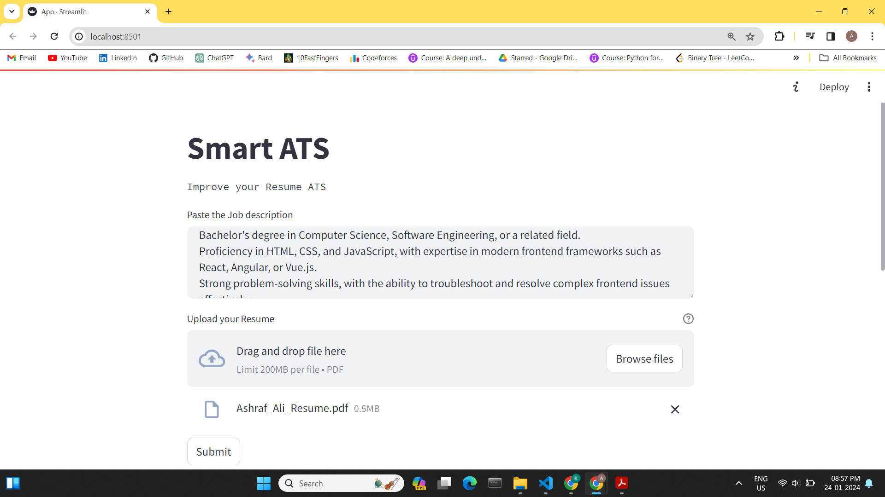
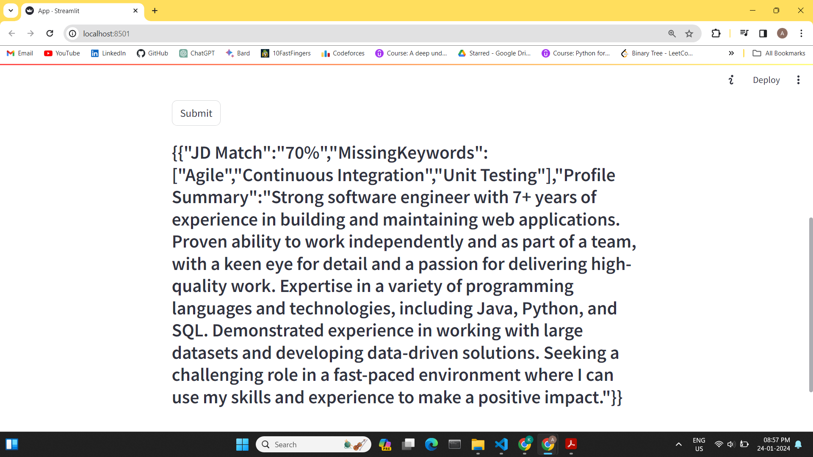

# A Generative AI based Applicant Tracking System (ATS)

## A simple and effective way of checking the matching % of your Resume for the job you apply

This project is built using the Google's Gemini-pro model for smart comparision of your resume and the job you applied for.
The input is simply the job description of the job you apply and your resume. 


* Easier for the user to keep track of the job description and the missing keywords in their resumes.
* More chances of getting a job by taking care of the main keywords.
* Finally, A paragraph that describes the profile summary.


<br><br>
## How to setup this project on your pc locally

Following are the step-by-step instructions to recreate the same project on your pc.

1. Clone this project

2. Create a Google API key from <a href = "https://makersuite.google.com/app/apikey"> here </a> and click on 'Create API key in new project' 
button. Copy the same and go to the .env file in this project and replace it with your API key.

3. Create a virtual environment
```bash
python -m venv myenv 
```

4. Activate the virtual environment
```bash
myenv\Srcipts\activate 
```


5. Install all the requirements
```bash
pip install -r requirements.txt
```

6. To run the script, run 
```bash 
streamlit run App.py
```


<br><br>
## Input and Output of the ATS application

Below are the snapshots of the application interface where we give the job description along with the resume.

* Given some random job description about a web development job with my resume.




* The final output from the model which shows the match score with the JD and also a profile summary.




"# GenAI-based-ATS-System" 
